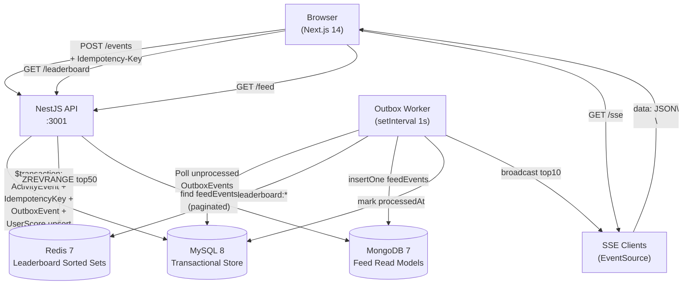
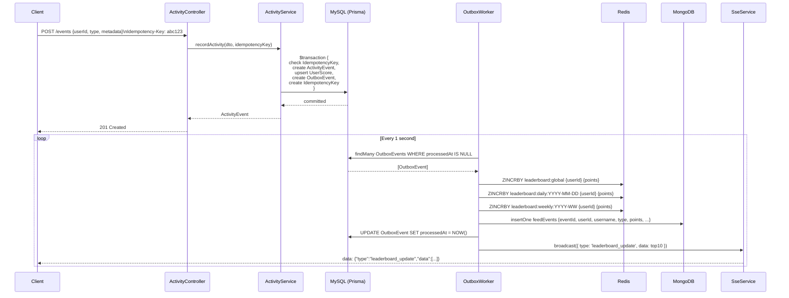

# PulseRank Architecture

## System Diagram



## Data Flow: Recording an Activity



## Design Decisions

### Transactional Outbox Pattern

**Problem:** Updating MySQL and Redis/MongoDB atomically is impossible across two databases.

**Solution:** Write the outbox entry to MySQL inside the same Prisma `$transaction` as the business data. A background worker reads unprocessed outbox entries and fans them out to the read stores. If the worker crashes mid-flight, it retries (events are idempotent on the read side because we use `eventId` as a deduplication key in MongoDB and `ZINCRBY` is safe to re-apply only once — handled by checking `processedAt` before processing).

### Idempotency

Every `POST /events` request requires an `Idempotency-Key` header. The key is stored in a dedicated `IdempotencyKey` table inside the same transaction. If a client retries with the same key, the unique constraint violation is caught and the existing result is returned with HTTP 200 rather than 201.

### Polyglot Persistence

| Store | Why |
|-------|-----|
| **MySQL** | ACID transactions for user data, scores, and the outbox |
| **Redis Sorted Sets** | `ZINCRBY` / `ZREVRANGE` give O(log N) leaderboard updates and O(log N + K) top-K reads |
| **MongoDB** | Schema-flexible feed documents with TTL index for automatic 30-day expiry |

### Redis Key Schema

```
leaderboard:global              # all-time cumulative scores
leaderboard:daily:2024-03-15    # points earned on a specific day
leaderboard:weekly:2024-11      # points earned in a specific ISO week
```

Daily and weekly keys could optionally be expired with `EXPIREAT` to save memory (not implemented in v1 — left as a straightforward extension).

### SSE vs WebSockets

SSE is chosen over WebSockets because:
1. Leaderboard updates are **server-push only** — no need for bidirectional communication.
2. SSE is built on HTTP/1.1 with automatic reconnect semantics in the browser (`EventSource`).
3. No extra dependency (no `socket.io`, no `ws`) — Node.js `http.ServerResponse` streams are sufficient.
4. Works through HTTP proxies and load balancers without special configuration.

### JWT Auth

JWTs are signed with HS256 and contain `{ sub: userId, username }`. They are stored in `localStorage` for simplicity. In a production environment, `httpOnly` cookies with CSRF protection would be preferred.

### Monorepo Structure

pnpm workspaces are used so that `packages/shared` types can be consumed by both `apps/api` and `apps/web` without publishing to npm. The `@pulserank/shared` package is built to `dist/` and referenced via `workspace:*` in each app's `package.json`.
